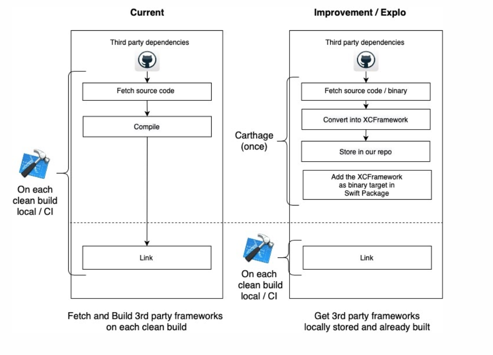

# Overview

- Usually, SPM checks out and builds all 3rd party dependencies with every clean build. 
In order to speed up the build process, we already built all 3rd party dependencies as XCFrameworks using the script in the `Dependencies` folder. 
- All dependencies are hosted in the same repo zipped in the `Dependencies` folder. 
- They're zipped in order to keep them under Github's file size limit of 100 MB. https://docs.github.com/en/github/managing-large-files/conditions-for-large-files

## Updating/Adding Dependencies
- To update or add a new dependency, you will need to update the `CartFile` in the root folder of the package
- Run `bundle exec Fastlane build_dependencies`, this will 
  - Use Carthage to build all the dependencies listed in the `CartFile` as XCframeworks 
  - For All downloaded universal (FAT) frameworks, the Fastlane script will convert them to XCFrameworks.
  - Compress all generated XCFrameworks and store them in `zipped` folder
  - Generate `carthage_licenses.md` file with aggregated carthage dependency licenses in `Carthage` directory
  - Update the `Package.swift` file to reflect new changes

## Extracting Dependencies
To build the `ios-mobility` project, you will need to extract all dependencies before opening Xcode
- Run `bundle exec Fastlane unzip_dependencies`, this will extract all dependencies in the correct folder `Carthage/Build`